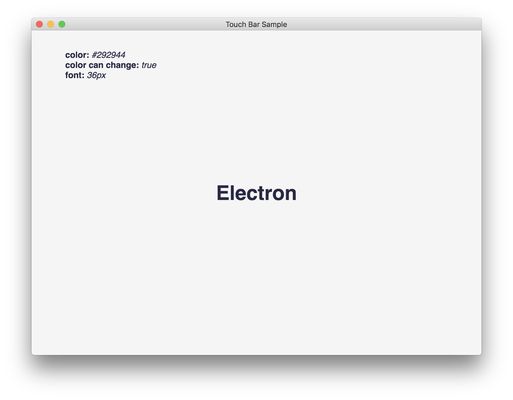
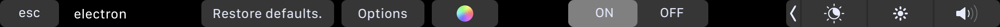

# Electron _Touch Bar_ API Sample
> Electron sample  [touch bar API](https://electron.atom.io/docs/api/touch-bar/)

# Installation
1. Clone this repo and extract it
2. Install dependencies (`npm install`)
3. Run it via `npm start`

# Usage
Once the app is running, play with the touchbar! It you should be something like this one below:
 
 

 

There are all `TouchBar` elements: 
- `Button` - Restore Defaults (restore defaults parameters)
- `Color Picker` - (change text color)
- `Slider` - Inside options (change the font size of the `H1`)
- `Group` - `Button`, `PopOver`, `Color Picker`
- `Scrubbler` - Inside options  (change the `H1` text)
- `Pop Over` - Options
- `Segmented Controller` - The On\Off switch (toggle if color can change true/false)
- `Spacer`
- `Label` - App name 
---

 
 

# Code of conduct
In the interest of fostering an open and welcoming environment, we as
contributors and maintainers pledge to making participation in our project and
our community a harassment-free experience for everyone, regardless of age, body
size, disability, ethnicity, gender identity and[...] 

- [Code Of Conduct](code-of-conduct.md)

# LICENSE
Copyright 2017 Federico Vitale &copy;

Permission is hereby granted, free of charge, to any person obtaining a copy of this software and associated documentation files (the "Software"), to deal in the Software without restriction, including without limitation the rights to use, copy, modify, merge, publish, distribute, sublicense, and/or sell copies of the Software, and to permit persons to whom the Software is furnished to do so, subject to the following conditions:

The above copyright notice and this permission notice shall be included in all copies or substantial portions of the Software.

THE SOFTWARE IS PROVIDED "AS IS", WITHOUT WARRANTY OF ANY KIND, EXPRESS OR IMPLIED, INCLUDING BUT NOT LIMITED TO THE WARRANTIES OF MERCHANTABILITY, FITNESS FOR A PARTICULAR PURPOSE AND NONINFRINGEMENT. IN NO EVENT SHALL THE AUTHORS OR COPYRIGHT HOLDERS BE LIABLE FOR ANY CLAIM, DAMAGES OR OTHER LIABILITY, WHETHER IN AN ACTION OF CONTRACT, TORT OR OTHERWISE, ARISING FROM, OUT OF OR IN CONNECTION WITH THE SOFTWARE OR THE USE OR OTHER DEALINGS IN THE SOFTWARE.

---

> If you enjoyed drop a star, it's free!  
> &mdash; Rawnly
